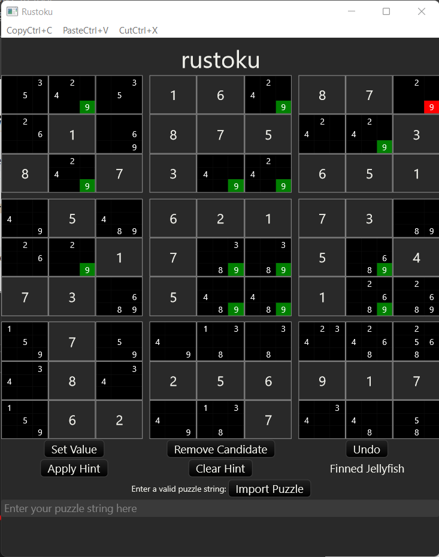
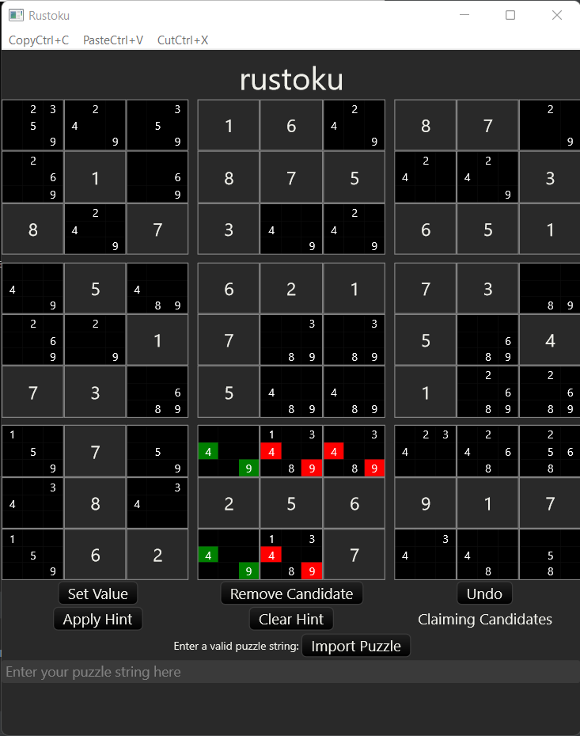
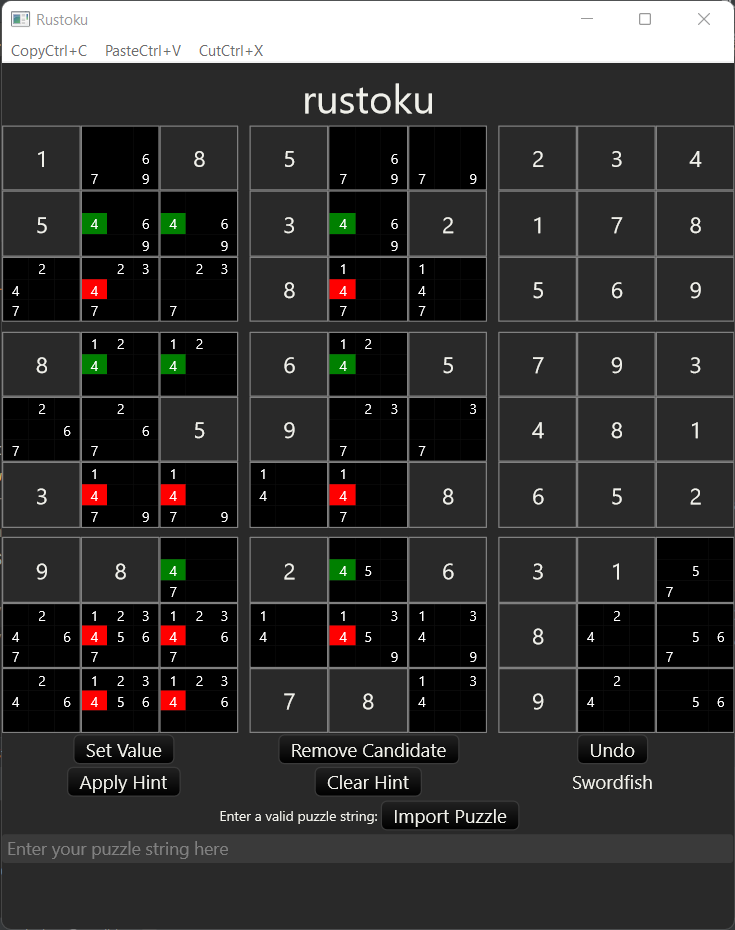
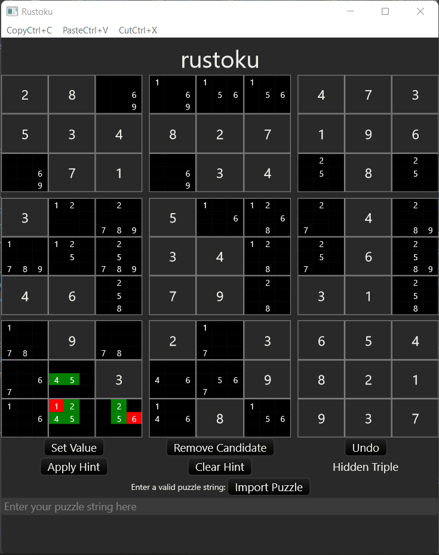
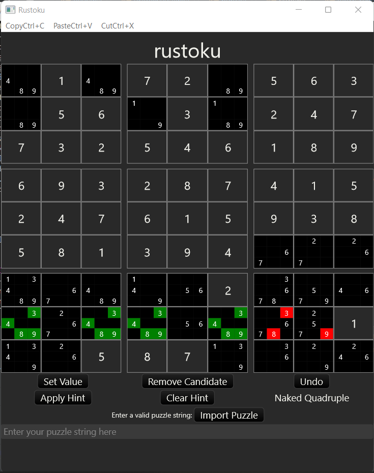

# Rustoku-GUI



A demonstration of the [Rustoku library](https://github.com/timlikestacos/rustoku).  
The GUI was build using Druid.

The focus of the [Rustoku library](https://github.com/timlikestacos/rustoku) is human solving techniques, and
to accomplish this, the focus is on potential candidates for each square.  Therefore, this application is 
developed around this focus.  Candidates are automatically populated and controlled 


## Screenshots 

  



## How to

### Build and run

```bash
cargo run --release
```

### Play

Clicking on a candidate will highlight that candidate.

Clicking again on the highlighted candidate will set the square to that value.  You can also click on `Set Value`.

Clicking on `Remove Candidate` will remove the highlighted candidate from the board. 

`Undo` will undo the last move, wether it was setting a value, removing a potential candidate, or applying a hint.  

`Hint` will get the next easiest solving method as determined by the [Rustoku](https://github.com/timlikestacos/rustoku) library.  
Candidates that can be removed (or used to set the value of the square) will be highlighted in red. 
Candidates that are used to obtain the hint will be highlighted in green. 
The `Hint` button will change to `Apply Button`.  If `Apply Button` is clicked, it applies the hint, wether it sets a 
value or removes potentials.

Repetative clicking on `Hint` and `Apply Hint` will visually display how the [Rustoku](https://github.com/timlikestacos/rustoku) library
 solves puzzles using human solving techniques

You can also import your own puzzle. Enter in an 81 character string in the box provided and click on `Import Puzzle`.  
Using a period (`.`) to designate blank squares is recommended, but any non-numerical character, or the number 0, will work.
While the [Rustoku](https://github.com/timlikestacos/rustoku) library detects multiple solutions for a given input puzzle,
 this gui will allow puzzles with multiple solutions.

## More Screenshots


